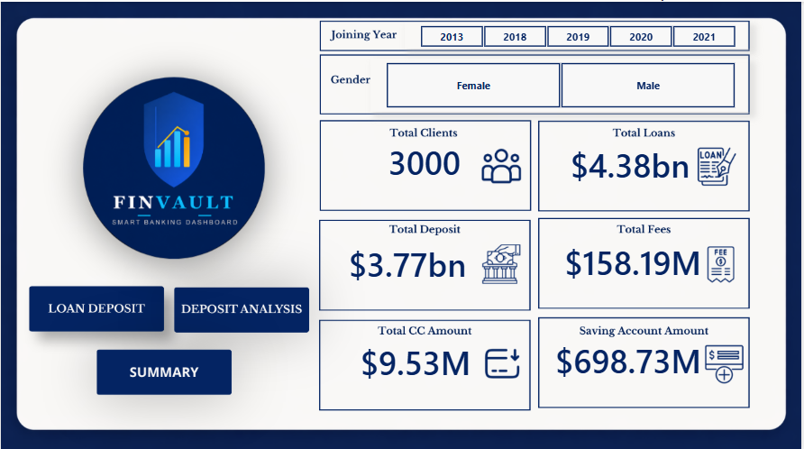
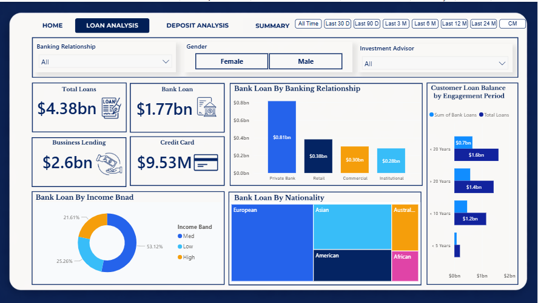
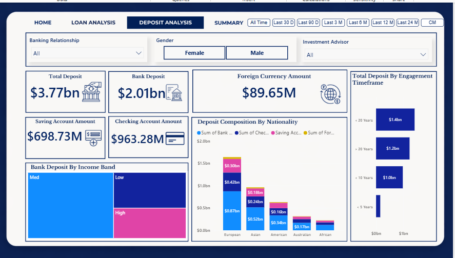
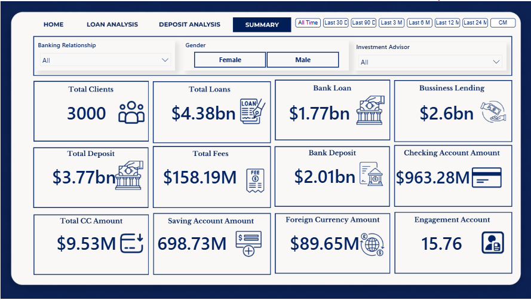

# 🏦 FINVAULT — Smart Banking Dashboard

> An interactive analytics dashboard designed to monitor customer financial behavior, assess risk, and deliver actionable insights for smarter banking decisions.


---

## 📌 Project Overview

**FINVAULT** is a full end-to-end data analytics project built on a real-world banking dataset of **3,000 clients**. The project covers the complete data analytics pipeline — from raw CSV ingestion through PostgreSQL, exploratory analysis in Python, to an interactive multi-page Power BI dashboard with dynamic DAX measures.

### Problem Statement
The banking sector faces significant challenges in managing credit risk and minimising losses during the lending process. This project builds a data-driven understanding of client financial profiles to support smarter loan approval decisions.

---

## 🗂️ Project Structure

```text
Banking Project/
│
├── FINVAULT_DESIGN/
│   ├── Logo & branding assets
│   ├── Dashboard templates
│   └── UI design resources
│
├── data/
│   ├── Banking.csv
│   └── Banking.xlsx
│
├── notebooks/
│   └── EDA.ipynb
│
├── dashboard/
│   └── Banking_Dashboard.pbix
│
├── presentation/
│   └── PPT.pptx
│
├── report/
│   ├── Report.docx
│   └── Report.pdf
│
├── requirements.txt
├── README.md
└── .gitignore
```

### Folder Description

| Folder/File | Description |
|---|---|
| `FINVAULT_DESIGN/` | Contains dashboard templates, logos, screenshots, and branding assets |
| `data/` | Raw banking datasets in CSV and Excel format |
| `notebooks/` | Python exploratory data analysis and preprocessing notebooks |
| `dashboard/` | Interactive Power BI dashboard (.pbix) |
| `presentation/` | PowerPoint presentation of the project |
| `report/` | Project documentation in Word and PDF formats |
| `requirements.txt` | Python dependencies required to run the notebook |
| `README.md` | Project overview and documentation |
| `.gitignore` | Files and folders excluded from Git tracking |

## 🛠️ Tech Stack

| Tool | Purpose |
|------|---------|
| **PostgreSQL 18** | Relational database storage & querying |
| **pgAdmin 4** | Database management & CSV import |
| **Python 3.11** | Exploratory Data Analysis (EDA) |
| **Pandas** | Data manipulation & cleaning |
| **Matplotlib / Seaborn** | Statistical visualisations & heatmaps |
| **SQLAlchemy + psycopg2** | Python ↔ PostgreSQL connection |
| **Jupyter Notebook** | Interactive analysis environment |
| **Power BI Desktop** | Interactive dashboard creation |
| **DAX** | Calculated columns & dynamic measures |
| **Power Query (M)** | Data transformation & ID mapping |

---

## 🔄 Data Pipeline

```
CSV File
   ↓
PostgreSQL (pgAdmin)     — Structured storage, table creation
   ↓
Python / Jupyter         — EDA, cleaning, correlation, visualisation
   ↓
Power BI (Power Query)   — Transformation, ID mapping, new columns
   ↓
Power BI (DAX)           — Measures, KPIs, time intelligence
   ↓
Power BI (Dashboard)     — 4-page interactive dashboard
```

---

## 📊 Dataset

- **3,000** banking clients
- **25** columns covering personal profiles, account balances, loans, and demographics
- Source: CSV file loaded into PostgreSQL

| Key Columns | Type | Description |
|---|---|---|
| Client ID | VARCHAR | Unique client identifier |
| Joined Bank | DATE | Date the client joined |
| Fee Structure | VARCHAR | High / Mid / Low |
| Estimated Income | FLOAT | Annual income estimate |
| Bank Loans | FLOAT | Personal loan balance |
| Business Lending | FLOAT | Business loan balance |
| Credit Card Balance | FLOAT | Current credit card debt |
| Bank Deposits | FLOAT | Total deposits |
| Checking / Saving Accounts | FLOAT | Account balances |
| Foreign Currency Account | FLOAT | FX account balance |
| BRId / GenderId / IAId | INT | IDs mapped to readable labels |

---

## 🧪 Python EDA Highlights
**Key Correlations Found:**
- Bank Deposits ↔ Checking Accounts: **0.84** (strongest)
- Bank Deposits ↔ Saving Accounts: **0.75**
- Bank Loans ↔ Business Lending: **0.42**
- Bank Loans ↔ Credit Card Balance: **0.37** (debt-layering risk)

---

## ⚡ DAX Measures

```dax
Total Loans =
    SUM('public customer'[Bank Loans]) +
    SUM('public customer'[Business Lending]) +
    SUM('public customer'[Credit Card Balance])

Total Deposits =
    SUM('public customer'[Bank Deposits]) +
    SUM('public customer'[Checking Accounts]) +
    SUM('public customer'[Saving Accounts]) +
    SUM('public customer'[Foreign Currency Account])

Total Fees =
    SUMX(
        'public customer',
        [Total Loans] * 'public customer'[Processing Fees]
    )

Total Clients = DISTINCTCOUNT('public customer'[Client ID])

Average Engagement Years =
    DIVIDE(AVERAGE('public customer'[Engagement Days]), 365)
```

---

## 📈 Dashboard Pages

| Page | Description |
|---|---|
| 🏠 **Home** | Logo, navigation, Gender & Joining Year slicers, 6 KPI cards |
| 📉 **Loan Analysis** | Loan breakdown by banking relationship, nationality, income band, engagement |
| 🏦 **Deposit Analysis** | Deposit composition by nationality, income band, engagement timeframe |
| 📋 **Summary** | All 12 KPIs in one view with full cross-filtering |

**Interactive Period Slicer:** All Time · Last 30D · Last 90D · Last 3M · Last 6M · Last 12M · Last 24M · CM · CQ · CY

---
## 📸 Dashboard Preview

Power BI interactive dashboard — filter by Gender, Category, Subscription Status, and Shipping Type.







## 💡 Key Insights

### Loans
- **Total Loans ($4.38bn) > Total Deposits ($3.77bn)** — $610M funding gap; bank relies on external funding
- **Business Lending ($2.6bn)** dominates — strong SME client base
- **Private Bank clients** carry the highest balances ($0.81bn)
- **Mid income band** = 53.12% of all loans — core credit segment

### Deposits
- **Bank Deposits ($2.01bn)** is the primary deposit channel
- **European clients** are the largest depositors across all account types
- Clients with **> 20 years** engagement hold **$1.4bn** in deposits — loyalty = volume
- **Checking Accounts ($963.28M)** — cross-sell opportunity for wealth management

### Risk
- Debt-layering pattern: Bank Loans ↔ Credit Card Balance correlation **(0.37)**
- **Private Bank concentration risk** — $0.81bn in a single segment
- **Superannuation** is independent of all banking variables → market retirement products separately
- **Total Fees: $158.19M** — High fee-structure clients are most profitable per loan

---

## 🚀 How to Run

### 1 — Python EDA
```bash
# Install dependencies
pip install -r requirements.txt

# Launch Jupyter
jupyter notebook EDA.ipynb
```

### 2 — PostgreSQL Setup
```sql
-- Create the table
CREATE TABLE customer (
    "Client ID" VARCHAR(50),
    "Name" VARCHAR(100),
    -- ... (see Report.pdf for full schema)
);

-- Import CSV via pgAdmin Import/Export tool
```

### 3 — Power BI Dashboard
```
1. Open Banking_Dashboard.pbix in Power BI Desktop
2. Update the PostgreSQL connection credentials if needed
3. Refresh the data
4. Explore all 4 dashboard pages
```

---

## 📦 Requirements

```
pandas
matplotlib
seaborn
sqlalchemy
psycopg2-binary
jupyter
numpy
```

Install with:
```bash
pip install -r requirements.txt
```

---

## 🔮 Future Improvements

- [ ] Connect Power BI directly to PostgreSQL for real-time data refresh
- [ ] Build a loan default prediction model (scikit-learn / XGBoost)
- [ ] Add a Drill Through page for individual client-level analysis
- [ ] Implement Row-Level Security (RLS) in Power BI
- [ ] Expand dataset with transaction history for time-series forecasting

---

## 📄 Report

The full project report is available in two formats:
- 📄 [`Report.docx`](./Report.docx) — Word document
- 📄 [`Report.pdf`](./Report.pdf) — PDF version

---
## 👨‍💻 About Me

I am a Data Science enthusiast focused on building end-to-end data projects and extracting actionable insights from data.

This project is part of my portfolio to demonstrate real-world analytics, data engineering, and business intelligence skills.


---
> ⭐ If you found this project useful, consider starring the repository — it helps others discover it too!

*FINVAULT — Smart Banking Dashboard | Data Analytics Portfolio Project | 2026*
